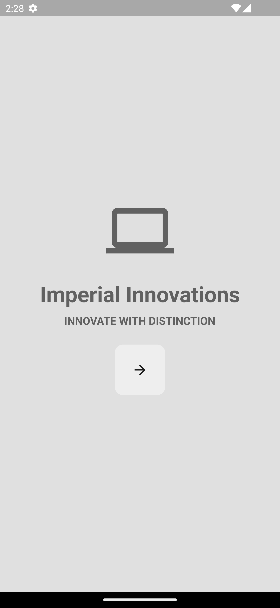
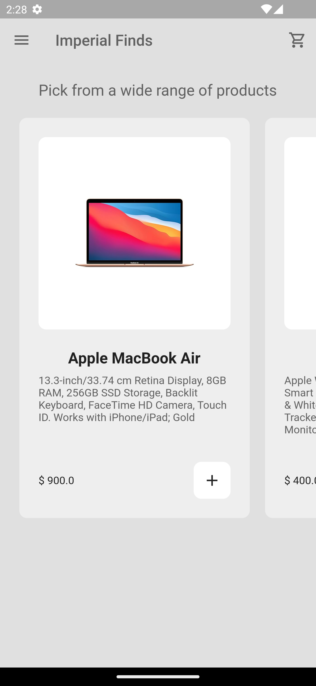
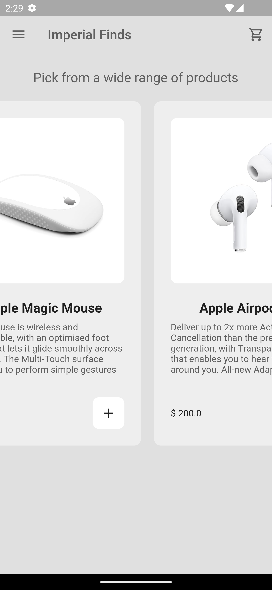
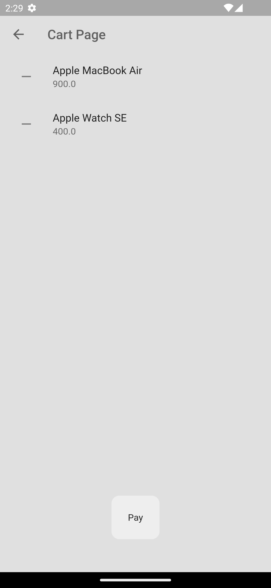

# Minimal Ecommerce App

This is a minimal ecommerce app built with Flutter.

## Features

- Browse products
- Add products to cart
- Checkout

## Getting Started

1. Clone the repository
2. Run `flutter pub get` to install dependencies
3. Run `flutter run` to start the app

## Screenshots

